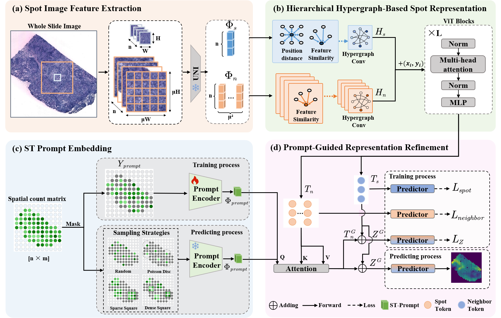

<<<<<<< HEAD
# PH2ST
## PH2ST: ST-Prompt Guided Histological Hypergraph Learning for Spatial Gene Expression in Whole Slide Images



**Abstract.** Spatial Transcriptomics (ST) reveals the spatial distribution of gene expression in tissues, offering critical insights into biological processes and disease mechanisms. However, the high cost, limited coverage, and technical complexity of current ST technologies restrict their widespread use in clinical and research settings, making obtaining high-resolution transcriptomic profiles across large tissue areas challenging. Predicting ST from H\&E-stained histology images has emerged as a promising alternative to address these limitations but remains challenging due to the heterogeneous relationship between histomorphology and gene expression, which is affected by substantial variability across patients and tissue sections. In response, we propose PH2ST, an ST-prompt guided histological hypergraph learning framework, which leverages limited ST signals as prompts to guide histological hypergraph learning for global spatial gene expression prediction. Our framework fuses histological hypergraph representations at multiple scales through a masked ST-prompt embedding mechanism, improving robustness and generalizability. Extensive evaluations on two public ST datasets and multiple prompt sampling strategies simulating real-world scenarios demonstrate that PH2ST not only outperforms existing state-of-the-art methods, but also shows strong potential for practical applications such as imputing missing spots, ST super-resolution, and local-to-global prediction—highlighting its value for scalable and cost-effective spatial gene expression mapping in biomedical contexts.

## Requirements

- Python 3.10+
- PyTorch 2.0+
- PyTorch Lightning 2.0+
- CUDA-enabled GPU (recommended)

PH2ST is tested on Python 3.11, PyTorch 2.4.1, PyTorch Lightning 2.5.0.post0, and CUDA 12.1.

---

### Training

To train model with cross-validation:

```bash
python src/main.py --config_name=<config_path> --mode=cv
```

Replace `<config_path>` with your configuration path.

### Evaluation

To evaluate the model:

```bash
python src/main.py --config_name=<config_path> --mode=eval
=======
# PH2ST
## PH2ST: ST-Prompt Guided Histological Hypergraph Learning for Spatial Gene Expression in Whole Slide Images


**Abstract.** Spatial Transcriptomics (ST) reveals the spatial distribution of gene expression in tissues, offering critical insights into biological processes and disease mechanisms. However, the high cost, limited coverage, and technical complexity of current ST technologies restrict their widespread use in clinical and research settings, making obtaining high-resolution transcriptomic profiles across large tissue areas challenging. Predicting ST from H\&E-stained histology images has emerged as a promising alternative to address these limitations but remains challenging due to the heterogeneous relationship between histomorphology and gene expression, which is affected by substantial variability across patients and tissue sections. In response, we propose PH2ST, an ST-prompt guided histological hypergraph learning framework, which leverages limited ST signals as prompts to guide histological hypergraph learning for global spatial gene expression prediction. Our framework fuses histological hypergraph representations at multiple scales through a masked ST-prompt embedding mechanism, improving robustness and generalizability. Extensive evaluations on two public ST datasets and multiple prompt sampling strategies simulating real-world scenarios demonstrate that PH2ST not only outperforms existing state-of-the-art methods, but also shows strong potential for practical applications such as imputing missing spots, ST super-resolution, and local-to-global prediction—highlighting its value for scalable and cost-effective spatial gene expression mapping in biomedical contexts.

## Requirements

- Python 3.10+
- PyTorch 2.0+
- PyTorch Lightning 2.0+
- CUDA-enabled GPU (recommended)

PH2ST is tested on Python 3.11, PyTorch 2.4.1, PyTorch Lightning 2.5.0.post0, and CUDA 12.1.

---

### Training

To train model with cross-validation:

```bash
python src/main.py --config_name=<config_path> --mode=cv
```

Replace `<config_path>` with your configuration path.

### Evaluation

To evaluate the model:

```bash
python src/main.py --config_name=<config_path> --mode=eval
>>>>>>> 1d6c8c5 (upload PH2ST)
```